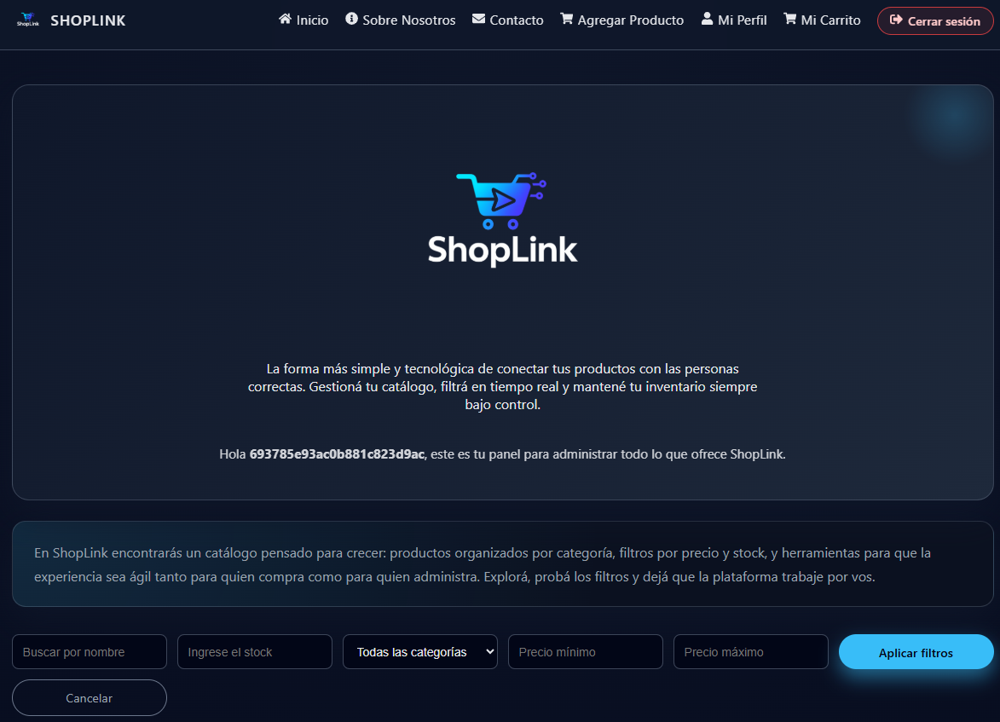

# 🛒 ShopLink Frontend

> Interfaz web para la gestión de productos de **ShopLink**, desarrollada como parte del **Trabajo Práctico: Desarrollo y Deploy de una API REST en TypeScript**.  
> Este README documenta **exclusivamente el frontend** (React + Vite).

---

## 📸 Vista general




---

## 👤 Datos del Autor

- **Nombre:** Alexis Esteban Roldan  
- **Proyecto:** ShopLink – Frontend  
- **Rol:** Estudiante de Desarrollo Full Stack / Responsable de Soporte Interno IT  
- **Email de contacto:** alexis.roldan@hasar.com  
- **GitHub:** [@alexlpda1420](https://github.com/alexlpda1420)  
- **LinkedIn:** [Alexis Esteban Roldan](https://www.linkedin.com/in/alexis-esteban-roldan/)

---

## 📚 Contexto del Trabajo Práctico

Este frontend acompaña a una API REST desarrollada en **Node.js + Express + TypeScript + MongoDB**, cuyo objetivo es gestionar un catálogo de productos con:

- Autenticación de usuarios.
- Manejo de productos (CRUD completo).
- Filtros avanzados por query params.
- Subida de imágenes y envío de correos.
- Deploy real en la nube.

El frontend de **ShopLink** se encarga de:

- Consumir la API desplegada en Render.
- Proveer una interfaz moderna, responsive y usable.
- Permitir probar todas las funcionalidades exigidas en la consigna del trabajo final.

---

## 🧰 Tecnologías del Frontend

**Core**

- ⚛️ **React** (SPA con componentes funcionales)
- ⚡ **Vite** como bundler y dev server
- 🌐 **React Router DOM** para enrutamiento
- 🧠 **Context API** para manejo de autenticación

**Estilos y UX**

- 🎨 **CSS moderno** con:
  - Variables en `:root`
  - Flexbox y Grid
  - Layout responsive (mobile-first)
- 💬 **SweetAlert2** para feedback visual (éxito, error, confirmaciones)

**Integraciones**

- 🔗 **Fetch API** para consumir la API de backend
- ☁️ **Vercel** como plataforma de deploy del frontend

---

## 🗂️ Estructura de carpetas (Frontend)

```bash
FRONTEND-UTN/
├─ node_modules/
├─ public/
├─ src/
│  ├─ assets/
│  │  └─ images/
│  │     └─ ShopLink-Logo.png
│  ├─ components/
│  │  ├─ Layout.jsx
│  │  ├─ ProtectedRoute.jsx
│  │  ├─ ToastMessage.jsx
│  │  ├─ Header.jsx
│  │  └─ Footer.jsx
│  ├─ constants/
│  │  └─ categories.js
│  ├─ context/
│  │  └─ AuthContext.jsx
│  ├─ pages/
│  │  ├─ Home.jsx
│  │  ├─ AboutUs.jsx
│  │  ├─ Contact.jsx
│  │  ├─ Login.jsx
│  │  ├─ Register.jsx
│  │  ├─ AddProduct.jsx
│  │  ├─ UpdateProduct.jsx
│  │  ├─ Profile.jsx
│  │  ├─ Cart.jsx          # placeholder / futura funcionalidad
│  │  └─ NotFound.jsx
│  ├─ router/
│  │  └─ Router.jsx
│  ├─ services/
│  │  └─ api.js
│  ├─ styles/
│  │  └─ index.css
│  ├─ main.jsx
│  └─ App.jsx              # si aplica
├─ .gitignore
├─ index.html
├─ package.json
├─ vite.config.js
└─ README.md
```

*(La estructura puede variar levemente según la última iteración del proyecto, pero la idea general se mantiene.)*

---

## 🧭 Navegación y rutas principales

### 🌐 `/` – Home

- Hero con el logo de **ShopLink** y una descripción del proyecto.
- Grid de productos con:
  - 📦 Listado de productos consumidos desde la API.
  - 🔍 Filtros por:
    - Nombre (búsqueda parcial).
    - Stock.
    - Categoría (usando `CATEGORIES` de `constants/categories.js`).
    - Precio mínimo y máximo.
  - 🖼️ Muestra la imagen del producto si existe (`uploads/...`) y texto alternativo si no.

- Botones por producto:
  - **Actualizar** → abre formulario para editar el producto.
  - **Borrar** → elimina el producto (con confirmación SweetAlert2).

---

### 🔐 `/login` – Login

- Formulario de inicio de sesión:
  - Email
  - Contraseña
- Envío de credenciales hacia la API de autenticación.
- Uso de **SweetAlert2** para:
  - Mostrar errores de credenciales.
  - Confirmar el login exitoso.
- Al iniciar sesión:
  - Se guarda el `token` en `localStorage`.
  - Se actualiza el estado global mediante `AuthContext`.
  - Se redirige al Home.

---

### 📝 `/registro` – Registro

- Formulario para crear usuario:
  - Email
  - Contraseña
- Validaciones mínimas en frontend:
  - Longitud mínima de la contraseña.
- SweetAlert2 para:
  - Errores de validación o de API.
  - Confirmación de usuario creado.
- Integra con el backend para:
  - Crear el usuario.
  - Disparar el correo de bienvenida mediante Resend (en backend).

---

### ➕ `/agregar-producto` – Agregar producto

- Ruta protegida con `ProtectedRoute` (solo para usuarios logueados).
- Formulario con:
  - Nombre
  - Descripción
  - Precio
  - Stock
  - Categoría (select con `CATEGORIES`)
  - Imagen (`input type="file"`)
- Uso de `FormData` para enviar campos + archivo.
- Validaciones y mensajes con SweetAlert2.

---

### ✏️ Actualización de producto – `UpdateProduct`

- Componente utilizado desde el Home para editar productos.
- Carga valores actuales del producto.
- Permite editar:
  - Nombre, descripción, precio, stock, categoría.
  - Imagen (opcional, reemplaza la anterior).
- Llama al backend con `PUT/PATCH` a la ruta correspondiente.

---

### ℹ️ `/sobre-nosotros` – AboutUs

Página descriptiva del proyecto ShopLink:

- Contexto del trabajo práctico.
- A quién está dirigido (docentes, revisores, compañeros).
- Tecnologías utilizadas en el frontend:
  - React, Vite, Router DOM, Context API.
  - CSS moderno, responsive y tema oscuro.
- Sección de **Características técnicas**:
  - Autenticación y rutas protegidas.
  - Diseño responsive.
  - Funcionalidades avanzadas (CRUD, filtros, subida de imágenes).
  - Experiencia de usuario.

---

### ✉️ `/contacto` – Contacto

- Formulario de contacto con:
  - Correo electrónico
  - Asunto
  - Mensaje
- Hace `POST` hacia `/email/send` en el backend.
- SweetAlert2 para:
  - Confirmar envío correcto.
  - Mostrar errores de servidor o conexión.

---

### 👤 `/perfil` – Mi Perfil

- Página que muestra la información del usuario autenticado:
  - Email
  - Nombre de usuario (derivado del email)
  - Rol dentro del proyecto.
- Incluye:
  - Avatar con inicial del usuario.
  - Logo de ShopLink en el encabezado.
  - Tarjetas con:
    - Datos de la cuenta.
    - Uso del usuario en el trabajo práctico.
    - Stack técnico asociado a autenticación y rutas protegidas.

---

### 🧺 `/carrito` – Carrito

- Página visualmente preparada como “Próximamente”.
- Sirve como punto de extensión para:
  - Persistencia de carrito.
  - Integración futura con órdenes y pagos.

---

### 🚫 `*` – NotFound

- Página personalizada de **404 – Página no encontrada**:
  - Mensaje amigable.
  - Botón para volver al inicio.
- En producción en Vercel se complementa con configuración de SPA (todas las rutas → `index.html`).

---

## 🎨 Diseño y estilos

- Tema **oscuro** con acentos neón:
  - Fondo principal basado en `#020617`.
  - Gradientes radiales y sombras profundas en cards.
  - Botones con degradados tipo `#0ea5e9 → #22c55e`.
- Secciones principales:
  - `Header` sticky con navbar e íconos en los links.
  - `Footer` con:
    - Enlaces útiles.
    - Redes sociales (React Icons).
    - Información de contacto del autor.
- CSS centralizado en `src/styles/index.css`:
  - Variables como `--bg`, `--primary`, `--accent`, etc.
  - Clases dedicadas:
    - `.hero`, `.home-products`, `.profile-*`, `.contact-form`, `.about-grid`, etc.
  - Media queries para:
    - Mobile (≤ 480px)
    - Tablet (≤ 880px)
    - Desktop (≥ 881px)

---

## 🔐 Autenticación en el frontend

- `AuthContext.jsx`:
  - Guarda el `token` y los datos básicos del usuario.
  - Expone funciones:
    - `login(credentials)`
    - `logout()`
    - `isAuthenticated` (boolean)
- `ProtectedRoute.jsx`:
  - Envuelve rutas protegidas.
  - Si el usuario no está autenticado → redirige a `/login`.
- Token:
  - Se persiste en `localStorage`.
  - Se limpia correctamente en `logout`.

---

## 🌐 Consumo de la API

- `src/services/api.js` centraliza el `baseURL` de la API.
- El frontend utiliza `fetch` para:

  - `GET /products?queryParams`  
    Filtros por nombre, stock, categoría, rango de precios.

  - `POST /products`  
    Creación de producto (texto + imagen).

  - `PUT /products/:id`  
    Actualización de producto.

  - `DELETE /products/:id`  
    Eliminación lógica/física según backend.

  - `POST /auth/register` y `POST /auth/login`  
    Registro e inicio de sesión de usuarios.

  - `POST /email/send`  
    Envío de mensajes desde el formulario de contacto.

- La URL base del backend se toma desde variable de entorno (`VITE_API_URL`).

---

## ⚙️ Variables de entorno (Frontend)

Crear un archivo `.env` en la raíz del frontend:

```bash
VITE_API_URL=https://backend-utn-1gp5.onrender.com
```

En el código:

```js
const API_URL = import.meta.env.VITE_API_URL
```

> ⚠️ **Importante:**  
> - No commitear `.env`.  
> - Incluir un `.env.example` con las claves necesarias para que cualquier persona pueda configurar el proyecto.

---

## 🧪 Scripts disponibles

En `package.json` del frontend:

```json
{
  "scripts": {
    "dev": "vite",
    "build": "vite build",
    "preview": "vite preview",
    "lint": "eslint src --ext .jsx,.js"
  }
}
```

### ▶️ Ejecutar en desarrollo

```bash
npm install
npm run dev
```

Abrir en el navegador:  
👉 `http://localhost:5173/` (por defecto en Vite).

### 📦 Build para producción

```bash
npm run build
npm run preview
```

---

## ☁️ Deploy

- **Frontend:** desplegado en **Vercel**.
- Pasos clave:
  1. Subir el repositorio a GitHub.
  2. Importar el proyecto en Vercel.
  3. Configurar la variable `VITE_API_URL` en **Project Settings → Environment Variables**.
  4. Verificar que la opción de **SPA / Single Page Application** tenga fallback a `index.html` (para rutas internas).

---

## ✅ Buenas prácticas aplicadas

- Separación de responsabilidades:
  - Componentes reutilizables (Layout, Header, Footer, ProductCard, etc.).
  - Context para autenticar y compartir el estado global.
  - Archivo de servicios para las llamadas HTTP.
- Código mantenible:
  - Nombres de carpetas y componentes consistentes.
  - Constantes centralizadas para categorías.
  - Rutas declaradas en un `Router.jsx` único.
- UX y accesibilidad:
  - Feedback inmediato en acciones clave (alt de imágenes, mensajes de error, loaders).
  - Botones y formularios con estados y mensajes claros.
  - Navegación coherente, con header y footer persistentes.
- Preparado para extensiones:
  - Página de carrito ya diseñada.
  - Perfil del usuario ampliable con más información desde la API.
  - AboutUs y Contact listos para documentación y comunicación del proyecto.

---

## 🚀 Posibles mejoras futuras

- Persistencia real del **carrito de compras** (en contexto, localStorage y backend).
- Paginación, ordenamiento y más filtros en la grilla de productos.
- Dashboard de métricas para administradores (cantidad de productos, ventas, etc.).
- Tema **dark/light** con toggle.
- Tests unitarios y de integración (Jest + React Testing Library).
- Internacionalización (i18n) para otros idiomas.

---

## 🙌 Agradecimientos

Este frontend fue construido como parte del proceso formativo en desarrollo Full Stack y como apoyo a la API REST en TypeScript.  
Si te sirve como referencia para tus propios proyectos o para enseñar/estudiar, misión cumplida. 💻✨  

**Gracias por visitar ShopLink.**
